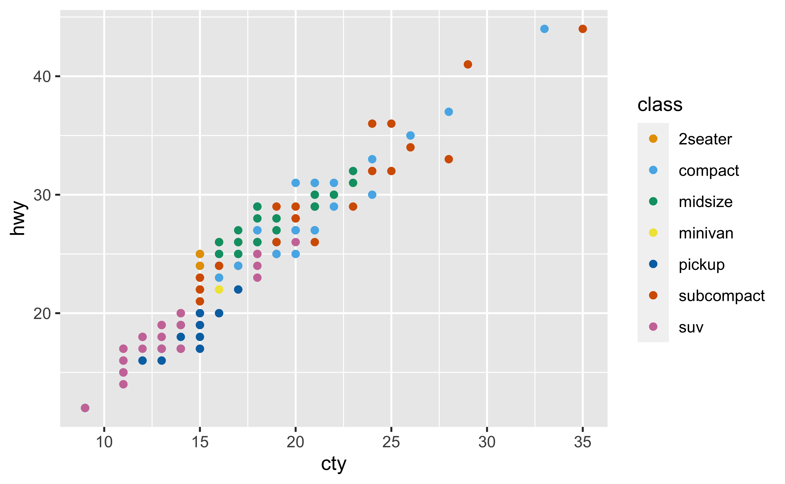
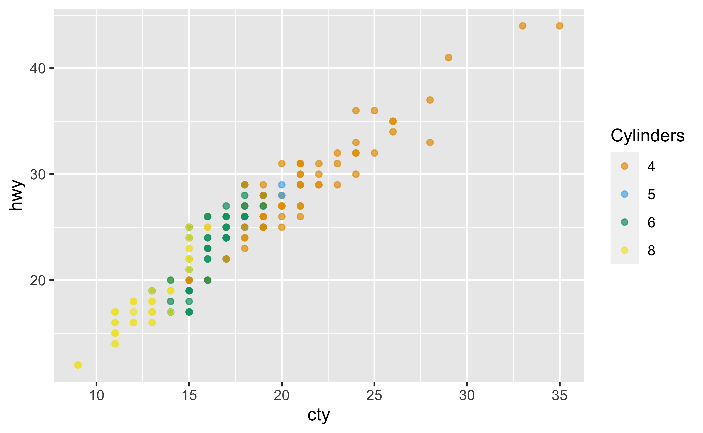
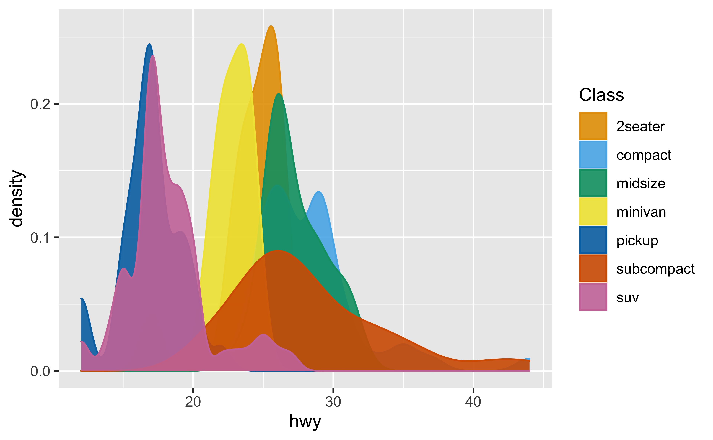
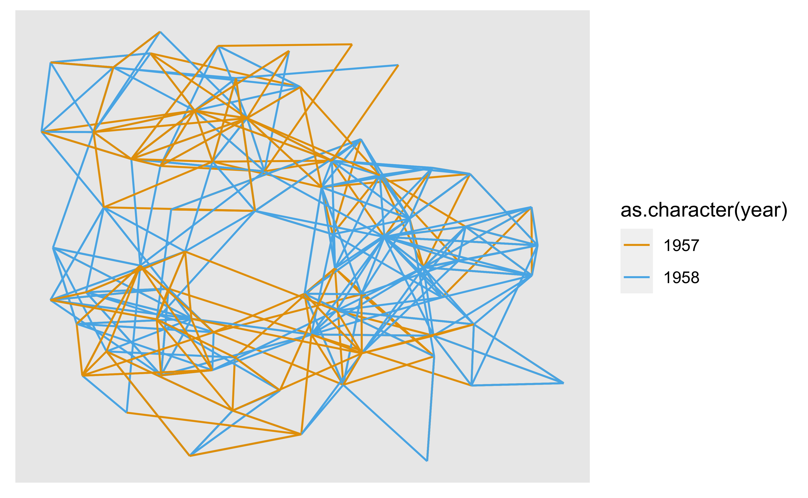

<!-- README.md is generated from README.Rmd. Please edit that file -->

# ggokabeito

<!-- badges: start -->

[](https://github.com/malcolmbarrett/ggokabeito/actions)
[](https://app.codecov.io/gh/malcolmbarrett/ggokabeito?branch=main)
[](https://CRAN.R-project.org/package=ggokabeito)
[](https://lifecycle.r-lib.org/articles/stages.html#experimental)
<!-- badges: end -->

ggokabeito provides ggplot2 and ggraph scales to easily use the
discrete, colorblind-friendly ‘Okabe-Ito’ palette in your data
visualizations. Currently, ggokabeito provides the following scales:

-   `scale_color_okabe_ito()`/`scale_colour_okabe_ito()`
-   `scale_fill_okabe_ito()`
-   `scale_edge_color_okabe_ito()`/`scale_edge_colour_okabe_ito()`

## Installation

You can install ggokabeito from CRAN with:

``` r
install.packages("ggokabeito")
```

You can alternatively install the development version of ggokabeito from
[GitHub](https://github.com/) with:

``` r
# install.packages("devtools")
devtools::install_github("malcolmbarrett/ggokabeito")
```

## Examples

``` r
library(ggokabeito)
library(ggplot2)

ggplot(mpg, aes(cty, hwy, color = class)) +
  geom_point() +
  scale_color_okabe_ito()
```



``` r
ggplot(mpg, aes(cty, hwy, color = factor(cyl))) +
  geom_point(alpha = 0.7) +
  scale_color_okabe_ito(name = "Cylinders", alpha = .9)
```



``` r
ggplot(mpg, aes(hwy, color = class, fill = class)) +
  geom_density() +
  scale_fill_okabe_ito(name = "Class", alpha = .9) +
  scale_color_okabe_ito(name = "Class")
```



ggokabeito also works with ggraph

``` r
# example from https://www.data-imaginist.com/2017/ggraph-introduction-edges/
library(ggraph, warn.conflicts = FALSE)
library(igraph, warn.conflicts = FALSE)

graph <- graph_from_data_frame(highschool)
pop1957 <- degree(
  delete_edges(graph, which(E(graph)$year == 1957)),
  mode = "in"
)
pop1958 <- degree(
  delete_edges(graph, which(E(graph)$year == 1958)),
  mode = "in"
)
V(graph)$pop_devel <- ifelse(
  pop1957 < pop1958,
  "increased",
  ifelse(pop1957 > pop1958, "decreased",
         "unchanged"
  )
)

V(graph)$popularity <- pmax(pop1957, pop1958)
E(graph)$year <- as.character(E(graph)$year)

ggraph(graph, layout = "kk") +
  geom_edge_link(aes(colour = as.character(year))) +
  scale_edge_color_okabe_ito()
```



## Similar work

ggokabeito is heavily inspired by the excellent
[colorblindr](https://github.com/clauswilke/colorblindr) package.
However, colorblindr is not currently on CRAN and includes some complex
features for analyzing colorblind safeness that are not necessary for
using the Okabe-Ito palette. Additionally, colorblindr was developed
prior to R 4.0.0, which set Okabe-Ito as the default discrete color
palette. ggokabeito thus has fewer overall dependencies but a strong one
on R 4.0.0 or greater.

## Code of Conduct

Please note that the ggokabeito project is released with a [Contributor
Code of
Conduct](https://malcolmbarrett.github.io/ggokabeito/CODE_OF_CONDUCT.html).
By contributing to this project, you agree to abide by its terms.
